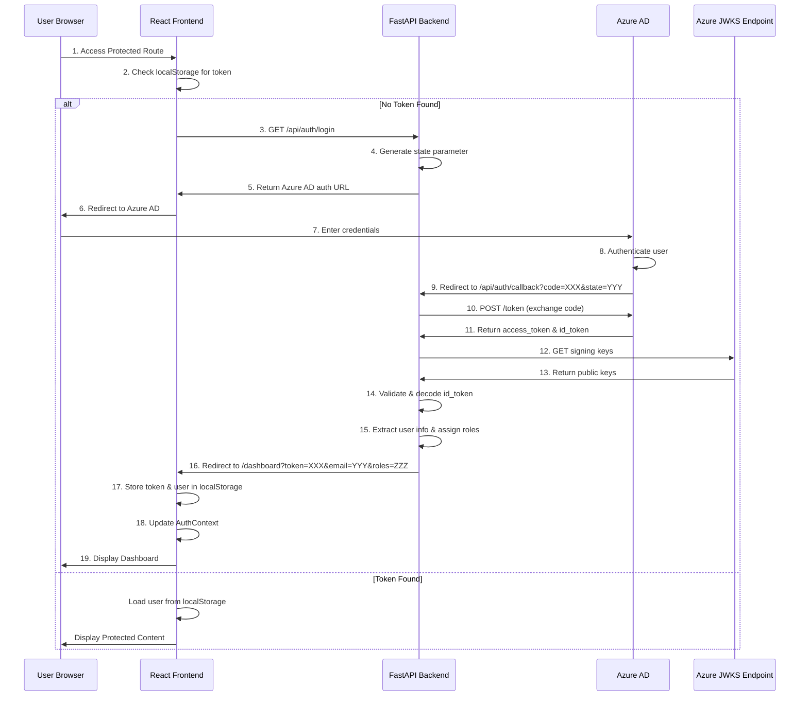

# Azure AD SSO Integration - Complete Learning Guide

## Table of Contents
1. [Overview](#overview)
2. [Architecture Diagram](#architecture-diagram)
3. [End-to-End Authentication Flow](#end-to-end-authentication-flow)
4. [Component Breakdown](#component-breakdown)
5. [Security Mechanisms](#security-mechanisms)
6. [Code Walkthrough](#code-walkthrough)
7. [Configuration & Setup](#configuration--setup)
8. [Learning Resources](#learning-resources)
9. [Common Issues & Troubleshooting](#common-issues--troubleshooting)

---

## Overview

This AEGIS application implements **Azure Active Directory (Azure AD) Single Sign-On (SSO)** using the **OAuth 2.0 Authorization Code Flow** with **OpenID Connect (OIDC)**. This allows users with Adani corporate accounts to authenticate seamlessly without managing separate credentials.

### Key Technologies
- **Backend**: FastAPI (Python)
- **Frontend**: React + TypeScript
- **Authentication Protocol**: OAuth 2.0 + OpenID Connect
- **Identity Provider**: Microsoft Azure AD
- **Token Validation**: JWT with RSA signature verification

---

## Architecture Diagram



---

## End-to-End Authentication Flow

### Phase 1: Login Initiation
**When**: User accesses a protected route without authentication

1. **Frontend Detection** ([ProtectedRoute.tsx](file:///d:/Adani_Project/aegis_phase_2_dev/Frontend/src/components/ProtectedRoute.tsx))
   - `ProtectedRoute` component checks `isAuthenticated` from `AuthContext`
   - If not authenticated, triggers `login()` function

2. **Backend Request** ([authService.ts](file:///d:/Adani_Project/aegis_phase_2_dev/Frontend/src/services/authService.ts#L21-L34))
   ```typescript
   // Frontend calls: GET /api/auth/login
   const response = await fetch(`${API_BASE_URL}/login`);
   const data = await response.json();
   window.location.href = data.redirect_url;
   ```

3. **Azure AD URL Construction** ([auth.py](file:///d:/Adani_Project/aegis_phase_2_dev/Backend/aegis_backend/routes/auth.py#L67-L89))
   ```python
   # Backend generates Azure AD authorization URL
   auth_url = f"https://login.microsoftonline.com/{TENANT_ID}/oauth2/v2.0/authorize?"
   auth_url += f"client_id={CLIENT_ID}&"
   auth_url += f"response_type=code&"
   auth_url += f"redirect_uri={REDIRECT_URI}&"
   auth_url += f"scope=openid profile email&"
   auth_url += f"state={state}&"
   auth_url += f"response_mode=query"
   ```

4. **User Redirect**
   - Browser redirects to Azure AD login page
   - User enters their `@adani.com` credentials

### Phase 2: Azure AD Authentication
**When**: User submits credentials to Azure AD

5. **Azure AD Processing**
   - Validates credentials against Active Directory
   - Checks user permissions and tenant membership
   - Generates authorization code

6. **Callback Redirect**
   - Azure AD redirects back to: `https://aegis.adani.com/api/auth/callback?code=AUTH_CODE&state=STATE_TOKEN`

### Phase 3: Token Exchange & Validation
**When**: Backend receives callback from Azure AD

7. **Authorization Code Exchange** ([auth.py](file:///d:/Adani_Project/aegis_phase_2_dev/Backend/aegis_backend/routes/auth.py#L92-L126))
   ```python
   # Backend exchanges code for tokens
   token_url = f"https://login.microsoftonline.com/{TENANT_ID}/oauth2/v2.0/token"
   token_data = {
       'grant_type': 'authorization_code',
       'client_id': CLIENT_ID,
       'client_secret': CLIENT_SECRET,
       'code': code,
       'redirect_uri': REDIRECT_URI
   }
   token_response = requests.post(token_url, data=token_data)
   id_token = token_response.json().get('id_token')
   ```

8. **JWT Signature Verification** ([auth.py](file:///d:/Adani_Project/aegis_phase_2_dev/Backend/aegis_backend/routes/auth.py#L128-L186))
   - Fetch OIDC configuration to get JWKS URI
   - Download public signing keys from Azure
   - Match token's `kid` (key ID) with correct public key
   - Verify RSA signature using `python-jose` library
   - Validate audience, issuer, and expiration

9. **User Information Extraction** ([auth.py](file:///d:/Adani_Project/aegis_phase_2_dev/Backend/aegis_backend/routes/auth.py#L188-L201))
   ```python
   user_id = payload.get('oid')      # Azure AD Object ID
   email = payload.get('email', payload.get('preferred_username'))
   name = payload.get('name')
   user_roles = get_user_roles_with_default(email)  # Local role mapping
   ```

### Phase 4: Session Creation & Frontend Storage
**When**: Backend successfully validates user

10. **Session Token Generation** ([auth.py](file:///d:/Adani_Project/aegis_phase_2_dev/Backend/aegis_backend/routes/auth.py#L203-L213))
    ```python
    session_token = secrets.token_urlsafe(32)
    target_url = f"/dashboard?token={session_token}&email={email}&name={name}&roles={','.join(user_roles)}"
    return RedirectResponse(url=target_url)
    ```

11. **Frontend Token Storage** ([AuthContext.tsx](file:///d:/Adani_Project/aegis_phase_2_dev/Frontend/src/contexts/AuthContext.tsx#L21-L66))
    ```typescript
    // Extract from URL parameters
    const tokenParams = searchParams.get("token");
    const email = searchParams.get("email");
    const rolesStr = searchParams.get("roles");
    
    // Store in localStorage
    localStorage.setItem("aegis_auth_token", tokenParams);
    localStorage.setItem("aegis_user", JSON.stringify(newUser));
    
    // Update React state
    setUser(newUser);
    ```

12. **Route Protection**
    - `ProtectedRoute` now sees `isAuthenticated = true`
    - User gains access to protected routes

---

## Component Breakdown

### Backend Components

#### 1. **auth.py** - Authentication Router
**Location**: [Backend/aegis_backend/routes/auth.py](file:///d:/Adani_Project/aegis_phase_2_dev/Backend/aegis_backend/routes/auth.py)

**Key Functions**:

| Function | Endpoint | Purpose |
|----------|----------|---------|
| `azure_ad_login()` | `GET /api/auth/login` | Generates Azure AD authorization URL |
| `azure_ad_callback()` | `GET /api/auth/callback` | Handles OAuth callback, validates tokens |
| `azure_ad_logout()` | `POST /api/auth/logout` | Clears session and returns logout URL |
| `get_user_roles_with_default()` | N/A (Helper) | Maps email to roles with corporate defaults |

**Environment Variables Required**:
```bash
AZURE_AD_CLIENT_ID=<your-app-registration-id>
AZURE_AD_CLIENT_SECRET=<your-app-secret>
AZURE_AD_TENANT_ID=<your-tenant-id>
AZURE_AD_REDIRECT_URI=https://aegis.adani.com/api/auth/callback
```

**Role Assignment Logic** ([auth.py](file:///d:/Adani_Project/aegis_phase_2_dev/Backend/aegis_backend/routes/auth.py#L43-L57)):
```python
def get_user_roles_with_default(email: str) -> List[str]:
    # 1. Check explicit role mapping
    roles = LOCAL_USER_ROLES.get(email.lower())
    if roles:
        return roles
    
    # 2. Default: Any @adani.com email gets 'viewer' access
    if email.lower().endswith("@adani.com"):
        return ["viewer"]
    
    # 3. No access for non-corporate emails
    return []
```

### Frontend Components

#### 2. **AuthContext.tsx** - Global Authentication State
**Location**: [Frontend/src/contexts/AuthContext.tsx](file:///d:/Adani_Project/aegis_phase_2_dev/Frontend/src/contexts/AuthContext.tsx)

**Responsibilities**:
- Manages global authentication state using React Context
- Handles URL parameter parsing after SSO callback
- Persists user data to `localStorage`
- Provides `login()` and `logout()` functions to entire app

**State Management**:
```typescript
interface AuthContextType {
    user: User | null;              // Current user object
    isAuthenticated: boolean;       // Auth status flag
    isLoading: boolean;             // Loading state during init
    login: () => Promise<void>;     // Trigger SSO flow
    logout: () => Promise<void>;    // Clear session
}
```

**Persistence Strategy**:
- **localStorage Keys**:
  - `aegis_auth_token`: Session token from backend
  - `aegis_user`: JSON-serialized user object

#### 3. **ProtectedRoute.tsx** - Route Guard Component
**Location**: [Frontend/src/components/ProtectedRoute.tsx](file:///d:/Adani_Project/aegis_phase_2_dev/Frontend/src/components/ProtectedRoute.tsx)

**Features**:
- **Auto-redirect**: Automatically triggers login if not authenticated
- **Loading state**: Shows spinner during auth check
- **Role-based access**: Supports `allowedRoles` prop for granular permissions

**Usage Example**:
```tsx
// Protect entire dashboard
<Route path="/dashboard" element={<ProtectedRoute />}>
  <Route index element={<DashboardHome />} />
</Route>

// Protect with role requirement
<Route path="/admin" element={
  <ProtectedRoute allowedRoles={['admin']}>
    <AdminPanel />
  </ProtectedRoute>
} />
```

#### 4. **authService.ts** - API Communication Layer
**Location**: [Frontend/src/services/authService.ts](file:///d:/Adani_Project/aegis_phase_2_dev/Frontend/src/services/authService.ts)

**API Methods**:
```typescript
authService.login()           // Initiates SSO flow
authService.logout()          // Ends session
authService.getCurrentUser()  // Validates token with backend
```

---

## Security Mechanisms

### 1. **State Parameter (CSRF Protection)**
- **Purpose**: Prevents Cross-Site Request Forgery attacks
- **Implementation**: 
  - Backend generates random state: `secrets.token_urlsafe(32)`
  - State is included in Azure AD redirect
  - Backend validates state matches on callback
- **Current Status**: ⚠️ State validation is logged but not enforced (production should verify)

### 2. **JWT Signature Verification**
- **Algorithm**: RS256 (RSA with SHA-256)
- **Process**:
  1. Extract `kid` (Key ID) from token header
  2. Fetch matching public key from Azure JWKS endpoint
  3. Verify signature using `python-jose` library
  4. Validate claims: `aud`, `iss`, `exp`

**Why This Matters**:
- Ensures token was issued by Azure AD (not forged)
- Confirms token hasn't been tampered with
- Validates token is for this specific application

### 3. **Token Claims Validation**
```python
payload = jose_jwt.decode(
    id_token,
    rsa_key,
    algorithms=["RS256"],
    audience=CLIENT_ID,        # Must match our app registration
    issuer=f"https://login.microsoftonline.com/{TENANT_ID}/v2.0"
)
```

### 4. **HTTPS Enforcement**
- All OAuth flows require HTTPS in production
- Redirect URI must use `https://` scheme

### 5. **Role-Based Access Control (RBAC)**
- Default role: `viewer` for all `@adani.com` emails
- Explicit admin mapping: `LOCAL_USER_ROLES` dictionary
- Frontend enforces role checks in `ProtectedRoute`

---

## Code Walkthrough

### Scenario: User Logs In for First Time

#### Step 1: User Clicks "Login" Button
```typescript
// Frontend: User clicks login
<button onClick={() => login()}>Login with SSO</button>

// AuthContext.tsx - login function
const login = async () => {
    await authService.login();  // Calls backend
};
```

#### Step 2: Backend Generates Azure AD URL
```python
# auth.py - /api/auth/login endpoint
@router.get("/api/auth/login")
async def azure_ad_login():
    state = secrets.token_urlsafe(32)  # Generate CSRF token
    
    auth_url = f"https://login.microsoftonline.com/{TENANT_ID}/oauth2/v2.0/authorize?"
    auth_url += f"client_id={CLIENT_ID}&"
    auth_url += f"response_type=code&"
    auth_url += f"redirect_uri={REDIRECT_URI}&"
    auth_url += f"scope=openid profile email&"
    auth_url += f"state={state}"
    
    return {"redirect_url": auth_url, "state": state}
```

#### Step 3: Frontend Redirects to Azure AD
```typescript
// authService.ts
const response = await fetch(`${API_BASE_URL}/login`);
const data = await response.json();
window.location.href = data.redirect_url;  // Full page redirect
```

#### Step 4: User Authenticates with Azure AD
- User enters `username@adani.com` and password
- Azure AD validates credentials
- User may see MFA prompt if enabled
- Azure AD generates authorization code

#### Step 5: Azure AD Redirects Back
```
https://aegis.adani.com/api/auth/callback?code=0.AXoA...&state=abc123
```

#### Step 6: Backend Exchanges Code for Token
```python
# auth.py - /api/auth/callback endpoint
token_url = f"https://login.microsoftonline.com/{TENANT_ID}/oauth2/v2.0/token"
token_data = {
    'grant_type': 'authorization_code',
    'client_id': CLIENT_ID,
    'client_secret': CLIENT_SECRET,
    'code': code,  # From URL parameter
    'redirect_uri': REDIRECT_URI
}

token_response = requests.post(token_url, data=token_data)
id_token = token_response.json().get('id_token')
```

#### Step 7: Backend Validates JWT
```python
# Fetch OIDC configuration
oidc_config_url = f"https://login.microsoftonline.com/{TENANT_ID}/v2.0/.well-known/openid-configuration"
oidc_config = requests.get(oidc_config_url).json()
jwks_url = oidc_config.get('jwks_uri')

# Get signing keys
jwks_response = requests.get(jwks_url)
jwks = jwks_response.json()

# Extract key ID from token
unverified_header = jose_jwt.get_unverified_header(id_token)
kid = unverified_header.get('kid')

# Find matching key
for key in jwks['keys']:
    if key['kid'] == kid:
        rsa_key = {
            'kty': key['kty'],
            'kid': key['kid'],
            'use': key['use'],
            'n': key['n'],
            'e': key['e']
        }
        break

# Verify and decode
payload = jose_jwt.decode(
    id_token,
    rsa_key,
    algorithms=["RS256"],
    audience=CLIENT_ID,
    issuer=oidc_config.get('issuer')
)
```

#### Step 8: Backend Extracts User Info & Assigns Roles
```python
user_id = payload.get('oid')  # Azure AD Object ID
email = payload.get('email', payload.get('preferred_username'))
name = payload.get('name')

# Check role mapping
user_roles = get_user_roles_with_default(email)
# For cogn206112@adani.com -> ['admin']
# For other@adani.com -> ['viewer']

user_info = {
    'user_id': user_id,
    'email': email,
    'name': name,
    'roles': user_roles
}
```

#### Step 9: Backend Creates Session & Redirects
```python
session_token = secrets.token_urlsafe(32)

target_url = f"/dashboard?token={session_token}&email={email}&name={urllib.parse.quote(name)}&roles={','.join(user_roles)}"

return RedirectResponse(url=target_url)
```

#### Step 10: Frontend Captures Callback & Stores Session
```typescript
// AuthContext.tsx - useEffect hook
useEffect(() => {
    const searchParams = new URLSearchParams(location.search);
    const tokenParams = searchParams.get("token");
    
    if (tokenParams) {
        const email = searchParams.get("email");
        const name = searchParams.get("name");
        const rolesStr = searchParams.get("roles");
        
        const newUser: User = {
            id: email,
            email,
            name: name || email,
            roles: rolesStr ? rolesStr.split(",") : [],
        };
        
        // Persist to localStorage
        localStorage.setItem("aegis_auth_token", tokenParams);
        localStorage.setItem("aegis_user", JSON.stringify(newUser));
        
        // Update React state
        setUser(newUser);
        
        // Clean URL
        navigate(location.pathname, { replace: true });
    }
}, [location, navigate]);
```

#### Step 11: User Accesses Dashboard
```typescript
// ProtectedRoute.tsx
const { user, isAuthenticated } = useAuth();

if (!isAuthenticated) {
    return null;  // Will trigger login
}

// User is authenticated - render protected content
return <Outlet />;
```

---

## Configuration & Setup

### Azure AD App Registration

1. **Create App Registration**
   - Navigate to Azure Portal → Azure Active Directory → App Registrations
   - Click "New registration"
   - Name: `AEGIS Application`
   - Supported account types: "Accounts in this organizational directory only"
   - Redirect URI: `https://aegis.adani.com/api/auth/callback`

2. **Configure Authentication**
   - Platform: Web
   - Redirect URIs: Add your callback URL
   - Implicit grant: Enable ID tokens (optional for hybrid flow)
   - Supported account types: Single tenant

3. **Create Client Secret**
   - Go to "Certificates & secrets"
   - Click "New client secret"
   - Description: "AEGIS Backend Secret"
   - Expires: 24 months (or custom)
   - **Copy the secret value immediately** (shown only once)

4. **API Permissions**
   - Add permissions: Microsoft Graph
   - Delegated permissions:
     - `openid` (Sign users in)
     - `profile` (View users' basic profile)
     - `email` (View users' email address)
   - Grant admin consent

5. **Note Configuration Values**
   ```
   Application (client) ID: xxxxxxxx-xxxx-xxxx-xxxx-xxxxxxxxxxxx
   Directory (tenant) ID: yyyyyyyy-yyyy-yyyy-yyyy-yyyyyyyyyyyy
   Client secret: your-secret-value
   ```

### Backend Environment Setup

Create `.env` file in backend directory:
```bash
# Azure AD Configuration
AZURE_AD_CLIENT_ID=xxxxxxxx-xxxx-xxxx-xxxx-xxxxxxxxxxxx
AZURE_AD_CLIENT_SECRET=your-secret-value
AZURE_AD_TENANT_ID=yyyyyyyy-yyyy-yyyy-yyyy-yyyyyyyyyyyy
AZURE_AD_REDIRECT_URI=https://aegis.adani.com/api/auth/callback

# For local development
# AZURE_AD_REDIRECT_URI=http://localhost:8000/api/auth/callback
```

### Frontend Configuration

Update API base URL in `authService.ts`:
```typescript
const API_BASE_URL = "/api/auth";  // Production
// const API_BASE_URL = "http://localhost:8000/api/auth";  // Development
```

### Testing Locally

1. **Update Redirect URI in Azure**
   - Add `http://localhost:8000/api/auth/callback` to allowed redirect URIs

2. **Update Environment Variable**
   ```bash
   AZURE_AD_REDIRECT_URI=http://localhost:8000/api/auth/callback
   ```

3. **Run Backend**
   ```bash
   cd Backend
   uvicorn aegis_backend.main:app --reload
   ```

4. **Run Frontend**
   ```bash
   cd Frontend
   npm run dev
   ```

5. **Test Flow**
   - Navigate to `http://localhost:5173`
   - Click login
   - Should redirect to Azure AD
   - After login, redirects back to localhost

---

## Learning Resources

### OAuth 2.0 & OpenID Connect Fundamentals

#### 1. **Understanding OAuth 2.0**
- **What it is**: Authorization framework for delegated access
- **Key Concept**: Allows third-party apps to access user resources without sharing passwords
- **Grant Types**:
  - Authorization Code (used here) - Most secure for web apps
  - Implicit - Deprecated for security reasons
  - Client Credentials - For machine-to-machine
  - Resource Owner Password - Legacy, not recommended

**Recommended Reading**:
- [OAuth 2.0 Simplified](https://aaronparecki.com/oauth-2-simplified/)
- [RFC 6749 - OAuth 2.0 Specification](https://datatracker.ietf.org/doc/html/rfc6749)

#### 2. **OpenID Connect (OIDC)**
- **What it is**: Identity layer on top of OAuth 2.0
- **Key Addition**: `id_token` (JWT) containing user identity claims
- **Scopes**:
  - `openid` - Required for OIDC
  - `profile` - Name, picture, etc.
  - `email` - Email address

**Recommended Reading**:
- [OpenID Connect Explained](https://openid.net/connect/)
- [OIDC Spec](https://openid.net/specs/openid-connect-core-1_0.html)

#### 3. **JWT (JSON Web Tokens)**
- **Structure**: `header.payload.signature`
  - **Header**: Algorithm and token type
  - **Payload**: Claims (user data, expiration, etc.)
  - **Signature**: Cryptographic signature for verification

**Example JWT Payload**:
```json
{
  "aud": "client-id-here",
  "iss": "https://login.microsoftonline.com/tenant-id/v2.0",
  "iat": 1609459200,
  "exp": 1609462800,
  "oid": "user-object-id",
  "email": "user@adani.com",
  "name": "John Doe"
}
```

**Recommended Tools**:
- [jwt.io](https://jwt.io) - Decode and inspect JWTs
- [JWT Debugger](https://jwt.ms) - Microsoft's JWT decoder

### Azure AD Specific Resources

#### 4. **Microsoft Identity Platform**
- [Microsoft Identity Platform Documentation](https://docs.microsoft.com/en-us/azure/active-directory/develop/)
- [Azure AD Authentication Flows](https://docs.microsoft.com/en-us/azure/active-directory/develop/authentication-flows-app-scenarios)
- [MSAL (Microsoft Authentication Library)](https://docs.microsoft.com/en-us/azure/active-directory/develop/msal-overview)

#### 5. **Key Azure AD Endpoints**
```
# Authorization endpoint
https://login.microsoftonline.com/{tenant}/oauth2/v2.0/authorize

# Token endpoint
https://login.microsoftonline.com/{tenant}/oauth2/v2.0/token

# OIDC configuration
https://login.microsoftonline.com/{tenant}/v2.0/.well-known/openid-configuration

# JWKS (signing keys)
https://login.microsoftonline.com/{tenant}/discovery/v2.0/keys

# Logout endpoint
https://login.microsoftonline.com/{tenant}/oauth2/v2.0/logout
```

### Security Best Practices

#### 6. **OWASP Guidelines**
- [OWASP OAuth 2.0 Security Cheat Sheet](https://cheatsheetseries.owasp.org/cheatsheets/OAuth2_Cheat_Sheet.html)
- [OWASP Authentication Cheat Sheet](https://cheatsheetseries.owasp.org/cheatsheets/Authentication_Cheat_Sheet.html)

#### 7. **Common Vulnerabilities**
- **CSRF**: Use state parameter (implemented)
- **Token Leakage**: Always use HTTPS
- **XSS**: Sanitize user input, use CSP headers
- **Token Storage**: Avoid localStorage for sensitive tokens (consider httpOnly cookies)

### Hands-On Learning

#### 8. **Interactive Tutorials**
- [OAuth 2.0 Playground](https://www.oauth.com/playground/)
- [Microsoft Identity Platform Samples](https://github.com/Azure-Samples/active-directory-python-webapp-graphapi-v2)

#### 9. **Video Courses**
- [OAuth 2.0 and OpenID Connect (in plain English)](https://www.youtube.com/watch?v=996OiexHze0) - Okta
- [Azure AD Authentication Deep Dive](https://docs.microsoft.com/en-us/shows/azure-friday/)

---

## Common Issues & Troubleshooting

### Issue 1: "Unable to find appropriate signing key"

**Symptoms**: Backend logs show `kid` mismatch error

**Cause**: Token's key ID doesn't match any keys in JWKS response

**Solution**:
```python
# Ensure appid parameter is added to JWKS URL
jwks_url += f"?appid={CLIENT_ID}"

# Log available keys for debugging
logger.info(f"Token kid: {kid}")
logger.info(f"Available kids: {[k.get('kid') for k in jwks.get('keys', [])]}")
```

### Issue 2: "Invalid token from Azure AD"

**Symptoms**: JWT decode fails with signature verification error

**Possible Causes**:
1. **Wrong audience**: Token issued for different app
2. **Wrong issuer**: Token from different tenant
3. **Expired token**: Check `exp` claim
4. **Clock skew**: Server time out of sync

**Solution**:
```python
# Decode without verification to inspect claims
unverified_claims = jose_jwt.get_unverified_claims(id_token)
logger.info(f"Token claims: {unverified_claims}")

# Check specific claims
assert unverified_claims['aud'] == CLIENT_ID
assert unverified_claims['iss'].startswith(f"https://login.microsoftonline.com/{TENANT_ID}")
```

### Issue 3: Infinite Redirect Loop

**Symptoms**: User keeps getting redirected to login

**Cause**: Token not being stored properly in localStorage

**Solution**:
```typescript
// Check browser console for errors
console.log("Token from URL:", searchParams.get("token"));
console.log("Stored token:", localStorage.getItem("aegis_auth_token"));

// Verify AuthContext is updating
console.log("Auth state:", { user, isAuthenticated });
```

### Issue 4: CORS Errors

**Symptoms**: Browser blocks requests to backend

**Solution**:
```python
# In FastAPI main.py
from fastapi.middleware.cors import CORSMiddleware

app.add_middleware(
    CORSMiddleware,
    allow_origins=["https://aegis.adani.com"],
    allow_credentials=True,
    allow_methods=["*"],
    allow_headers=["*"],
)
```

### Issue 5: Role Not Applied

**Symptoms**: User authenticated but lacks expected permissions

**Cause**: Email not in `LOCAL_USER_ROLES` mapping

**Solution**:
```python
# Check role assignment
logger.info(f"User {email} assigned roles: {user_roles}")

# Add user to mapping
LOCAL_USER_ROLES["newuser@adani.com"] = ["admin"]

# Or use API endpoint
POST /api/auth/user/add
{
  "email": "newuser@adani.com",
  "roles": ["admin"]
}
```

### Issue 6: Token Expired After Page Refresh

**Symptoms**: User logged out after browser refresh

**Cause**: Session token not persisted or expired

**Solution**:
```typescript
// Implement token refresh logic
useEffect(() => {
    const token = localStorage.getItem("aegis_auth_token");
    if (token) {
        // Validate token with backend
        authService.getCurrentUser()
            .then(user => setUser(user))
            .catch(() => {
                // Token invalid, clear storage
                localStorage.removeItem("aegis_auth_token");
                localStorage.removeItem("aegis_user");
            });
    }
}, []);
```

---

## Advanced Topics

### 1. **Implementing Token Refresh**

Currently, the implementation uses a simple session token. For production:

```python
# Generate JWT with expiration
import jwt
from datetime import datetime, timedelta

def create_access_token(user_data: dict):
    payload = {
        'user_id': user_data['user_id'],
        'email': user_data['email'],
        'roles': user_data['roles'],
        'exp': datetime.utcnow() + timedelta(hours=1),
        'iat': datetime.utcnow()
    }
    return jwt.encode(payload, SECRET_KEY, algorithm='HS256')

def create_refresh_token(user_id: str):
    payload = {
        'user_id': user_id,
        'exp': datetime.utcnow() + timedelta(days=30),
        'type': 'refresh'
    }
    return jwt.encode(payload, SECRET_KEY, algorithm='HS256')
```

### 2. **Middleware for Token Validation**

```python
from fastapi import Request, HTTPException
from fastapi.security import HTTPBearer, HTTPAuthorizationCredentials

security = HTTPBearer()

async def verify_token(credentials: HTTPAuthorizationCredentials = Depends(security)):
    try:
        payload = jwt.decode(credentials.credentials, SECRET_KEY, algorithms=['HS256'])
        return payload
    except jwt.ExpiredSignatureError:
        raise HTTPException(status_code=401, detail="Token expired")
    except jwt.InvalidTokenError:
        raise HTTPException(status_code=401, detail="Invalid token")

# Use in protected endpoints
@router.get("/api/protected")
async def protected_route(user = Depends(verify_token)):
    return {"message": f"Hello {user['email']}"}
```

### 3. **Database-Backed Role Management**

Replace `LOCAL_USER_ROLES` with database:

```python
import sqlite3

def get_user_roles_from_db(email: str) -> List[str]:
    conn = sqlite3.connect('aegis.db')
    cursor = conn.cursor()
    cursor.execute("SELECT role FROM user_roles WHERE email = ?", (email,))
    roles = [row[0] for row in cursor.fetchall()]
    conn.close()
    
    if not roles and email.endswith("@adani.com"):
        return ["viewer"]
    return roles
```

### 4. **Audit Logging**

```python
def log_authentication_event(email: str, event_type: str, success: bool):
    conn = sqlite3.connect('aegis.db')
    cursor = conn.cursor()
    cursor.execute("""
        INSERT INTO auth_logs (email, event_type, success, timestamp)
        VALUES (?, ?, ?, ?)
    """, (email, event_type, success, datetime.utcnow()))
    conn.commit()
    conn.close()

# Usage
log_authentication_event(email, "login", True)
```

---

## Summary

This AEGIS application implements enterprise-grade SSO using:

✅ **OAuth 2.0 Authorization Code Flow** - Industry standard for web apps  
✅ **OpenID Connect** - Identity layer for user authentication  
✅ **JWT Validation** - Cryptographic verification of tokens  
✅ **Role-Based Access Control** - Granular permission management  
✅ **Secure Token Storage** - localStorage with React Context  
✅ **Protected Routes** - Automatic login redirection  

**Key Security Features**:
- State parameter for CSRF protection
- RSA signature verification
- Audience and issuer validation
- HTTPS enforcement
- Corporate email domain validation

**Production Recommendations**:
1. Implement proper session management (Redis/database)
2. Use httpOnly cookies instead of localStorage
3. Add token refresh mechanism
4. Implement rate limiting on auth endpoints
5. Add comprehensive audit logging
6. Use environment-specific redirect URIs
7. Implement proper state validation
8. Add MFA support

---

**Last Updated**: February 2, 2026  
**Version**: 1.0  
**Maintained By**: AEGIS Development Team
