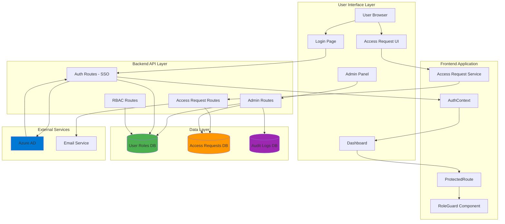
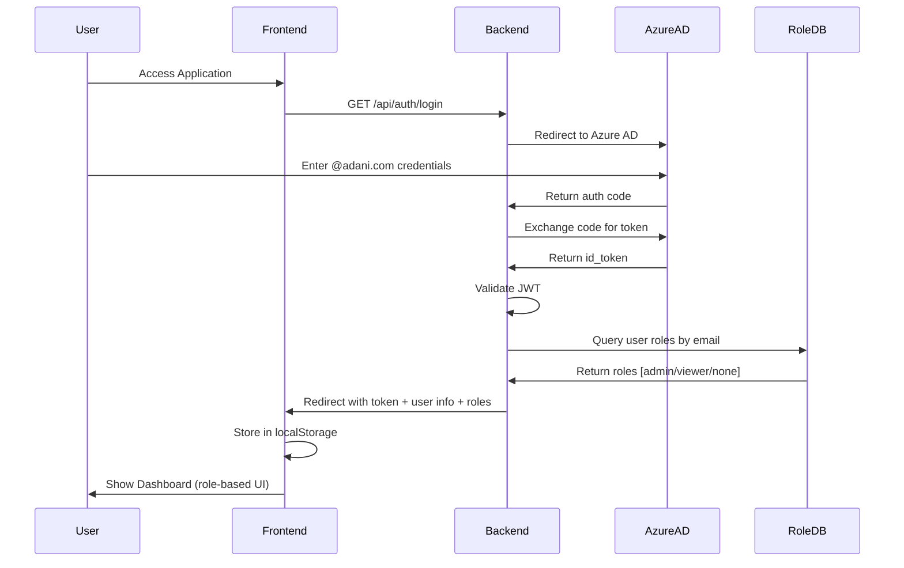
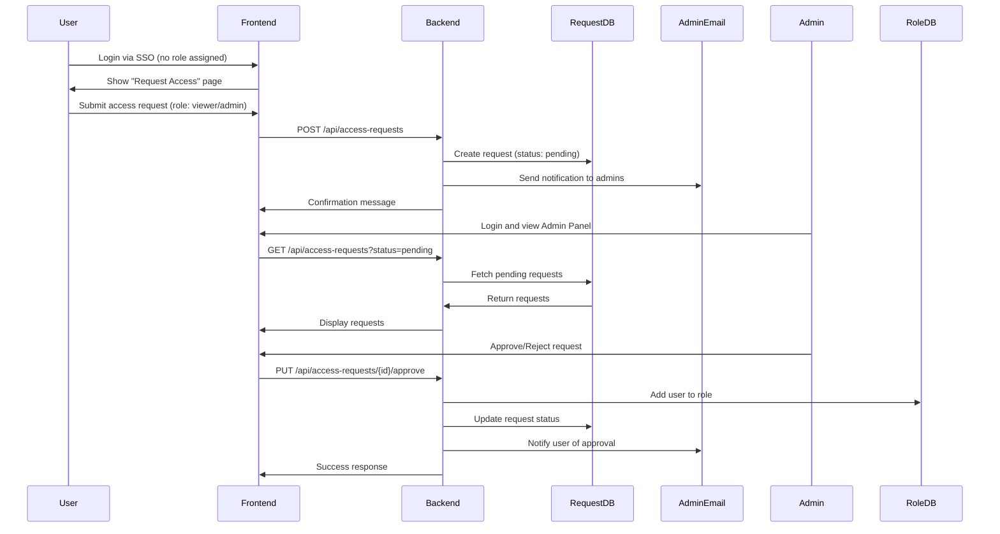
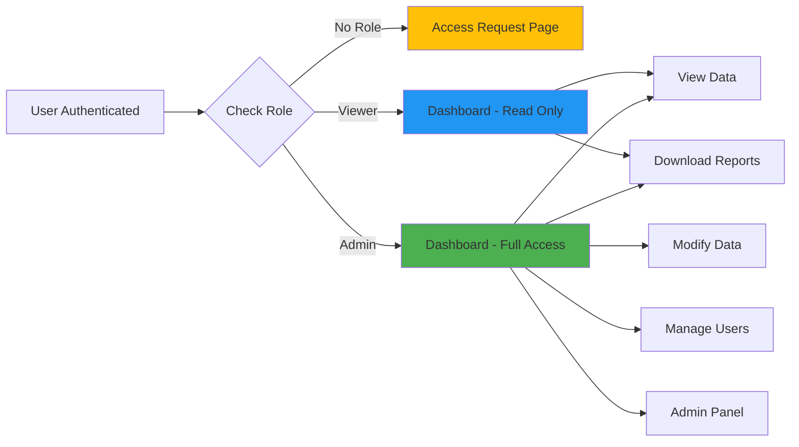

# SSO Integration Plan with Enhanced Role-Based Access Control (RBAC)

## Problem Statement

### Current Situation
The AEGIS application currently has **two separate authentication systems** running in parallel:

1. **Azure AD SSO Authentication** (New System)
   - Users authenticate via `@adani.com` corporate credentials
   - Automatic role assignment: `viewer` for all corporate users
   - Manual admin assignment via hardcoded `LOCAL_USER_ROLES` dictionary
   - Used for main application access

2. **Legacy Admin Authentication** (Old System)
   - Fixed username/password stored in database (`admin_credentials` table)
   - Used for specific admin features (email management, data modifications)
   - Separate login flow with `adminAuth.ts` utility
   - No integration with SSO system

### Key Problems

#### 1. **Dual Authentication Confusion**
- Users must authenticate twice: once via SSO, then again for admin features
- SSO roles (`admin`, `viewer`) are not connected to legacy admin system
- Inconsistent user experience across the application

#### 2. **Manual Role Management**
- Admins are hardcoded in backend: `LOCAL_USER_ROLES = {"cogn206112@adani.com": ["admin"]}`
- No UI to add/remove users from roles
- Requires code deployment to change permissions
- No audit trail of role changes

#### 3. **No Self-Service Access Request**
- New users cannot request access
- No workflow for users to request elevated permissions
- Admins have no visibility into pending access requests

#### 4. **Scalability Issues**
- Current system doesn't scale across multiple applications (BSE, RBI, SEBI, etc.)
- Each application would need separate role management
- No centralized user management

#### 5. **Security Concerns**
- Fixed credentials in database (plaintext passwords)
- No password rotation policy
- No session timeout or token expiration
- No audit logging for authentication events

---

## Proposed Solution

### Unified SSO-Based RBAC System

Replace the dual authentication system with a **single, unified Azure AD SSO system** with comprehensive role-based access control and self-service access request workflow.

---

## Architecture Overview



---

## Detailed Architecture

### 1. Authentication Flow (SSO Only)



### 2. Access Request Flow (Self-Service)



### 3. Role-Based UI Rendering



---

## Database Schema

### 1. Route Permissions Table (Primary Access Control)
```sql
CREATE TABLE route_permissions (
    id INTEGER PRIMARY KEY AUTOINCREMENT,
    email VARCHAR(255) NOT NULL,
    route_path VARCHAR(255) NOT NULL,  -- e.g., '/bse-alerts', '/insider-trading', '/minutes-preparation'
    permission_type VARCHAR(50) NOT NULL,  -- 'view', 'admin', 'edit'
    assigned_by VARCHAR(255),  -- Email of admin who assigned
    assigned_at TIMESTAMP DEFAULT CURRENT_TIMESTAMP,
    updated_at TIMESTAMP DEFAULT CURRENT_TIMESTAMP,
    is_active BOOLEAN DEFAULT 1,
    notes TEXT,  -- Optional notes about why access was granted
    CONSTRAINT chk_permission_type CHECK (permission_type IN ('view', 'admin', 'edit')),
    CONSTRAINT chk_email_domain CHECK (
        email LIKE '%@adani.com' OR 
        email LIKE '%@pspprojects.com' OR
        email LIKE '%@adaniltd.onmicrosoft.com' OR
        email LIKE '%@adani-total.in' OR
        email LIKE '%@ndtv.com' OR
        email LIKE '%@itdcem.co.in'
    ),
    UNIQUE(email, route_path, permission_type)
);

CREATE INDEX idx_route_permissions_email ON route_permissions(email);
CREATE INDEX idx_route_permissions_route ON route_permissions(route_path);
CREATE INDEX idx_route_permissions_active ON route_permissions(is_active);
```

### 2. Route Definitions Table (Route Metadata)
```sql
CREATE TABLE route_definitions (
    id INTEGER PRIMARY KEY AUTOINCREMENT,
    route_path VARCHAR(255) NOT NULL UNIQUE,
    route_name VARCHAR(255) NOT NULL,  -- Human-readable name
    description TEXT,
    application VARCHAR(100) NOT NULL,  -- 'aegis', 'bse', 'rbi', 'sebi', 'insider-trading', 'directors-disclosure', 'minutes-preparation'
    parent_route VARCHAR(255),  -- For nested routes
    requires_admin BOOLEAN DEFAULT 0,  -- If true, only admin permission type allowed
    is_active BOOLEAN DEFAULT 1,
    created_at TIMESTAMP DEFAULT CURRENT_TIMESTAMP
);

CREATE INDEX idx_route_definitions_application ON route_definitions(application);
CREATE INDEX idx_route_definitions_parent ON route_definitions(parent_route);

-- Seed data for existing routes
INSERT INTO route_definitions (route_path, route_name, description, application, requires_admin) VALUES
('/bse-alerts', 'BSE Alerts', 'BSE regulatory alerts and notifications', 'bse', 0),
('/rbi-dashboard', 'RBI Dashboard', 'RBI compliance dashboard', 'rbi', 0),
('/sebi-dashboard', 'SEBI Dashboard', 'SEBI regulatory dashboard', 'sebi', 0),
('/insider-trading', 'Insider Trading', 'Insider trading monitoring and compliance', 'insider-trading', 0),
('/directors-disclosure', 'Directors Disclosure', 'Directors disclosure management with tabs: Data Source, Master Data, Companies Master Data', 'directors-disclosure', 0),
('/minutes-preparation', 'Minutes Preparation', 'Board meeting minutes preparation', 'minutes-preparation', 1);
```

### 3. Access Requests Table (Updated for Route-Based Permissions)
```sql
CREATE TABLE access_requests (
    id INTEGER PRIMARY KEY AUTOINCREMENT,
    email VARCHAR(255) NOT NULL,
    name VARCHAR(255),
    requested_route VARCHAR(255) NOT NULL,  -- Specific route being requested
    requested_permission VARCHAR(50) NOT NULL,  -- 'view' or 'admin'
    justification TEXT,  -- Why they need access
    status VARCHAR(50) DEFAULT 'pending',  -- 'pending', 'approved', 'rejected'
    requested_at TIMESTAMP DEFAULT CURRENT_TIMESTAMP,
    reviewed_by VARCHAR(255),  -- Email of admin who reviewed
    reviewed_at TIMESTAMP,
    review_notes TEXT,  -- Admin's notes on approval/rejection
    CONSTRAINT chk_requested_permission CHECK (requested_permission IN ('view', 'admin', 'edit')),
    CONSTRAINT chk_status CHECK (status IN ('pending', 'approved', 'rejected'))
);

CREATE INDEX idx_access_requests_email ON access_requests(email);
CREATE INDEX idx_access_requests_status ON access_requests(status);
CREATE INDEX idx_access_requests_route ON access_requests(requested_route);
```

---

## Permission Matrix (Initial Setup)

### Route-Based Access Control

| Route Path | Permission Type | Assigned Users |
|------------|----------------|----------------|
| `/bse-alerts` | **admin** | cogn206112@adani.com |
| `/bse-alerts` | **view** | AdaniSecretarial@adaniltd.onmicrosoft.com<br>Anil.Agrawal1@adani.com<br>Bhavik.parikh@adani.com<br>Chandan.Lakhwani@adani.com<br>Deepak.Pandya@adani.com<br>GoriShankar.Paliwal@adani.com<br>Jaladhi.Shukla@adani.com<br>Kamlesh.Bhagia@adani.com<br>Krunal.Jain@adani.com<br>Kuntal.Chandya@adani.com<br>Manish.Mistry@adani.com<br>Mira.Soni@adani.com<br>Mokshil.Shah@adani.com<br>Nishant.Joshi@adani.com<br>Nishit.Dave@adani.com<br>Paresh.Patel@adani-total.in<br>Pawan.Parakh@adani.com<br>Pranavm.Mehta@adani.com<br>Puneet.Bansal@adani.com<br>Rohit.Porwal@adani.com<br>Romita.Jaiswal@adani.com<br>Shailesh.Sawa@adani.com<br>Shrishti.JAIN@adani.com<br>Urvish.Bhardwaj@adani.com<br>Vijil.Jain@adani.com<br>Viral.Raval@adani.com<br>abhishek.bansal@adani.com<br>dharmesha.desai@adani.com<br>nikhilg@ndtv.com<br>parinitad@ndtv.com<br>pragnesh.darji@adani.com<br>rahul.neogi@itdcem.co.in<br>sameer.devda@adani.com<br>vishal.shah3@adani.com |
| `/rbi-dashboard` | **admin** | cogn206112@adani.com |
| `/rbi-dashboard` | **view** | *(Same 34 users as above)* |
| `/sebi-dashboard` | **admin** | cogn206112@adani.com |
| `/sebi-dashboard` | **view** | *(Same 34 users as above)* |
| `/insider-trading` | **view** | durgesh.tiwari@adani.com<br>cogn206112@adani.com |
| `/directors-disclosure` | **view** | durgesh.tiwari@adani.com<br>cogn206112@adani.com<br>*(Includes all tabs: Data Source, Master Data, Companies Master Data)* |
| `/minutes-preparation` | **admin** | durgesh.tiwari@adani.com<br>cogn206112@adani.com |

### Permission Types Explained

- **admin**: Full access - can view, edit, delete, and manage data
- **view**: Read-only access - can view data but cannot modify
- **edit**: Can view and modify data but cannot delete or manage users

### Access Rules

1. **Default Behavior**: Users NOT in the permission matrix get **NO ACCESS** to any route
2. **Route Protection**: All routes require explicit permission assignment
3. **Tab-Based Modules**: Some routes have tabs that inherit parent permission
   - **Directors Disclosure**: Access to `/directors-disclosure` grants access to ALL tabs:
     - Data Source tab
     - Master Data tab
     - Companies Master Data tab
   - Frontend checks only parent route permission, tabs are UI-level navigation
4. **Standalone Routes**: Other routes are independent (BSE, RBI, SEBI, Insider Trading, Minutes Preparation)
5. **Multi-Route Access**: Users can have different permission types on different routes
6. **Self-Service Requests**: Any authenticated user can request access to any route

---

### 3. Audit Logs Table
```sql
CREATE TABLE auth_audit_logs (
    id INTEGER PRIMARY KEY AUTOINCREMENT,
    email VARCHAR(255) NOT NULL,
    event_type VARCHAR(100) NOT NULL,  -- 'login', 'logout', 'role_assigned', 'role_revoked', 'access_requested', 'access_approved', 'access_rejected'
    event_details TEXT,  -- JSON with additional details
    ip_address VARCHAR(45),
    user_agent TEXT,
    timestamp TIMESTAMP DEFAULT CURRENT_TIMESTAMP,
    application VARCHAR(100) DEFAULT 'aegis'
);

CREATE INDEX idx_audit_logs_email ON auth_audit_logs(email);
CREATE INDEX idx_audit_logs_event_type ON auth_audit_logs(event_type);
CREATE INDEX idx_audit_logs_timestamp ON auth_audit_logs(timestamp);
```

---

## Feature Breakdown

### Phase 1: Unified SSO Authentication (Remove Legacy Admin)

#### Features:
1. **Remove Legacy Admin Login**
   - Delete `adminAuth.ts` utility
   - Remove admin login UI components
   - Delete `admin_credentials` table
   - Remove `/admin/login` endpoint

2. **Integrate SSO Roles with UI**
   - Use SSO roles (`admin`, `viewer`) for all authorization
   - Show/hide UI elements based on role
   - Disable buttons for viewers, enable for admins

3. **Database-Backed Role Management**
   - Replace `LOCAL_USER_ROLES` dictionary with `user_roles` table
   - Query database on SSO callback to get user roles
   - Cache roles in JWT token

#### Backend Changes:
- [auth.py](file:///d:/Adani_Project/aegis_phase_2_dev/Backend/aegis_backend/routes/auth.py#L43-L57): Replace `get_user_roles_with_default()` to query database
- [admin.py](file:///d:/Adani_Project/aegis_phase_2_dev/Backend/aegis_backend/routes/admin.py#L51-L98): Delete `/admin/login` endpoint
- Create new `rbac.py` route module for role management

#### Frontend Changes:
- [adminAuth.ts](file:///d:/Adani_Project/aegis_phase_2_dev/Frontend/src/utils/adminAuth.ts): Delete entire file
- [WebsiteData.tsx](file:///d:/Adani_Project/aegis_phase_2_dev/Frontend/src/pages/WebsiteData.tsx): Remove admin login UI, use SSO roles
- [ProtectedRoute.tsx](file:///d:/Adani_Project/aegis_phase_2_dev/Frontend/src/components/ProtectedRoute.tsx): Enhance to support role-based rendering

---

### Phase 2: Self-Service Access Request System

#### Features:
1. **Access Request Page**
   - Shown to authenticated users with no role assigned
   - Form to request access: Name, Email (pre-filled), Role (dropdown), Justification (textarea)
   - Submit button creates access request
   - Confirmation message with expected review time

2. **Admin Approval Workflow**
   - New "Access Requests" tab in Admin Panel
   - Table showing pending requests with user details
   - Approve/Reject buttons with optional notes
   - Email notifications to users on approval/rejection

3. **Email Notifications**
   - To Admins: New access request submitted
   - To User: Request approved/rejected
   - Include direct links to application

#### Backend Endpoints:

```python
# New RBAC Routes (/api/rbac)

POST   /api/access-requests              # Submit access request
GET    /api/access-requests              # List all requests (admin only)
GET    /api/access-requests/my-requests  # User's own requests
PUT    /api/access-requests/{id}/approve # Approve request (admin only)
PUT    /api/access-requests/{id}/reject  # Reject request (admin only)
GET    /api/users/roles                  # List all users with roles (admin only)
POST   /api/users/roles                  # Assign role to user (admin only)
DELETE /api/users/{email}/roles          # Revoke role (admin only)
GET    /api/users/me/permissions         # Get current user's permissions
```

#### Frontend Components:

```typescript
// New Components
components/
  ├── AccessRequestForm.tsx      // Form to request access
  ├── AccessRequestStatus.tsx    // Show request status
  ├── AdminAccessRequests.tsx    // Admin panel for requests
  ├── UserRoleManagement.tsx     // Admin panel for role management
  └── RoleGuard.tsx              // Component-level role protection

// New Pages
pages/
  ├── AccessRequest.tsx          // Access request page
  └── AdminPanel.tsx             // Enhanced admin panel
```

---

### Phase 3: Multi-Application Support

#### Features:
1. **Application Selector**
   - Users can have different roles in different applications
   - Dropdown to switch between applications (AEGIS, BSE, RBI, SEBI)
   - Roles are application-specific

2. **Centralized User Management**
   - Single database for all applications
   - Admin can assign roles across applications
   - User sees all their applications in one place

#### Database Changes:
- Add `application` column to `user_roles` and `access_requests` tables
- Composite unique constraint on `(email, application)`

#### Backend Changes:
- Add `application` parameter to all role queries
- Filter roles by application context
- Support bulk role assignment across applications

---

### Phase 4: Advanced Security & Audit

#### Features:
1. **Session Management**
   - Replace simple token with JWT with expiration
   - Implement token refresh mechanism
   - Session timeout after 8 hours of inactivity

2. **Audit Logging**
   - Log all authentication events
   - Log all role changes
   - Log all access request events
   - Admin dashboard to view audit logs

3. **Security Enhancements**
   - Rate limiting on login attempts
   - IP whitelisting for admin actions
   - MFA support (future)
   - Password-less authentication (future)

---

## Implementation Plan

### Step 1: Database Setup
**Time Estimate**: 1 hour

1. Create migration script to add new tables:
   - `user_roles`
   - `access_requests`
   - `auth_audit_logs`

2. Migrate existing admin user to `user_roles` table:
   ```sql
   INSERT INTO user_roles (email, role, assigned_by, application)
   VALUES ('cogn206112@adani.com', 'admin', 'system', 'aegis');
   ```

3. Drop `admin_credentials` table

**Verification**:
```bash
# Run migration script
python Backend/scripts/migrate_rbac.py

# Verify tables created
sqlite3 Backend/aegis_backend/public/email_data.db ".schema user_roles"
```

---

### Step 2: Backend - RBAC Routes
**Time Estimate**: 3 hours

1. Create `Backend/aegis_backend/routes/rbac.py`:
   - Implement all RBAC endpoints
   - Add role-based middleware
   - Add audit logging

2. Update `Backend/aegis_backend/routes/auth.py`:
   - Replace `get_user_roles_with_default()` to query database
   - Add audit logging for login events

3. Delete legacy admin login from `Backend/aegis_backend/routes/admin.py`

**Verification**:
```bash
# Start backend
cd Backend
uvicorn aegis_backend.main:app --reload

# Test endpoints with curl
curl -X POST http://localhost:8000/api/access-requests \
  -H "Content-Type: application/json" \
  -d '{"email":"test@adani.com","requested_role":"viewer","justification":"Need access"}'
```

---

### Step 3: Frontend - Remove Legacy Admin
**Time Estimate**: 2 hours

1. Delete `Frontend/src/utils/adminAuth.ts`

2. Update `Frontend/src/pages/WebsiteData.tsx`:
   - Remove admin login UI
   - Use `useAuth()` hook for role checks
   - Show/hide buttons based on `user.roles.includes('admin')`

3. Update all pages to use SSO roles instead of legacy admin

**Verification**:
```bash
# Build frontend
cd Frontend
npm run build

# Check for any references to adminAuth
grep -r "adminAuth" src/
```

---

### Step 4: Frontend - Access Request UI
**Time Estimate**: 4 hours

1. Create `Frontend/src/components/AccessRequestForm.tsx`
2. Create `Frontend/src/pages/AccessRequest.tsx`
3. Create `Frontend/src/components/AdminAccessRequests.tsx`
4. Update routing to show access request page for users with no role

**Verification**:
- Manual testing: Login with new user, verify access request form shows
- Submit request, verify it appears in admin panel
- Approve request, verify user gains access

---

### Step 5: Email Notifications
**Time Estimate**: 2 hours

1. Create email templates for:
   - Access request submitted (to admins)
   - Access approved (to user)
   - Access rejected (to user)

2. Integrate with existing email service

**Verification**:
- Submit access request, verify admin receives email
- Approve request, verify user receives email

---

### Step 6: Multi-Application Support
**Time Estimate**: 3 hours

1. Add `application` parameter to all RBAC endpoints
2. Update UI to show application selector
3. Filter roles by application context

**Verification**:
- Assign user to multiple applications
- Switch between applications, verify roles change

---

### Step 7: Audit Logging & Security
**Time Estimate**: 3 hours

1. Implement audit logging for all events
2. Create admin dashboard to view logs
3. Add JWT token expiration and refresh

**Verification**:
- Perform various actions, verify logs are created
- Check token expiration works
- Test token refresh flow

---

## User Experience Flow

### Scenario 1: New User Requests Access

1. **User**: Navigates to `https://aegis.adani.com`
2. **System**: Redirects to Azure AD login
3. **User**: Enters `newuser@adani.com` credentials
4. **System**: Authenticates via Azure AD, checks database for roles
5. **System**: No role found, redirects to Access Request page
6. **User**: Sees form with pre-filled email, selects "Viewer" role, enters justification
7. **User**: Clicks "Submit Request"
8. **System**: Creates access request, sends email to admins
9. **User**: Sees confirmation: "Your request has been submitted. You will be notified via email once reviewed."

### Scenario 2: Admin Approves Access

1. **Admin**: Logs in via SSO
2. **System**: Recognizes admin role, shows full dashboard
3. **Admin**: Clicks "Admin Panel" → "Access Requests" tab
4. **Admin**: Sees pending request from `newuser@adani.com`
5. **Admin**: Reviews justification, clicks "Approve"
6. **System**: Adds user to `user_roles` table with "viewer" role
7. **System**: Sends email to `newuser@adani.com`: "Your access request has been approved"
8. **User**: Logs in again, now has viewer access to dashboard

### Scenario 3: Viewer Uses Application

1. **Viewer**: Logs in via SSO
2. **System**: Recognizes viewer role, shows dashboard
3. **Viewer**: Can view all data, download reports
4. **Viewer**: Sees "Edit" buttons but they are disabled with tooltip: "Admin access required"
5. **Viewer**: Can request admin access via "Request Admin Access" button

### Scenario 4: Admin Manages Users

1. **Admin**: Goes to Admin Panel → "User Management" tab
2. **Admin**: Sees table of all users with their roles
3. **Admin**: Can:
   - Add new user directly (bypass access request)
   - Change user role (viewer ↔ admin)
   - Revoke access (remove role)
   - View user's access history
4. **System**: Logs all changes in audit log

---

## UI Mockups

### Access Request Page
```
┌─────────────────────────────────────────────────────────┐
│  AEGIS - Access Request                                 │
├─────────────────────────────────────────────────────────┤
│                                                         │
│  Welcome to AEGIS!                                      │
│  You need access to use this application.              │
│                                                         │
│  ┌─────────────────────────────────────────────────┐   │
│  │ Request Access                                  │   │
│  ├─────────────────────────────────────────────────┤   │
│  │                                                 │   │
│  │ Name: [John Doe                              ] │   │
│  │                                                 │   │
│  │ Email: [john.doe@adani.com                   ] │   │
│  │        (pre-filled from SSO)                   │   │
│  │                                                 │   │
│  │ Requested Role: [Viewer ▼]                     │   │
│  │                 Options: Viewer, Admin         │   │
│  │                                                 │   │
│  │ Justification:                                 │   │
│  │ ┌─────────────────────────────────────────┐   │   │
│  │ │ I need access to view market data for   │   │   │
│  │ │ my role as Financial Analyst...         │   │   │
│  │ └─────────────────────────────────────────┘   │   │
│  │                                                 │   │
│  │              [Submit Request]                  │   │
│  │                                                 │   │
│  └─────────────────────────────────────────────────┘   │
│                                                         │
│  ℹ️ Your request will be reviewed by administrators.   │
│     You will receive an email notification.            │
│                                                         │
└─────────────────────────────────────────────────────────┘
```

### Admin Panel - Access Requests Tab
```
┌─────────────────────────────────────────────────────────────────────────┐
│  Admin Panel                                                            │
├─────────────────────────────────────────────────────────────────────────┤
│  [Dashboard] [User Management] [Access Requests] [Audit Logs]          │
├─────────────────────────────────────────────────────────────────────────┤
│                                                                         │
│  Pending Access Requests (3)                                           │
│                                                                         │
│  ┌───────────────────────────────────────────────────────────────────┐ │
│  │ Name          Email              Role    Justification    Actions │ │
│  ├───────────────────────────────────────────────────────────────────┤ │
│  │ John Doe      john@adani.com     Viewer  Need to view...  [✓][✗] │ │
│  │ Jane Smith    jane@adani.com     Admin   Team lead for... [✓][✗] │ │
│  │ Bob Johnson   bob@adani.com      Viewer  Analyst role...  [✓][✗] │ │
│  └───────────────────────────────────────────────────────────────────┘ │
│                                                                         │
│  Click [✓] to approve or [✗] to reject                                 │
│                                                                         │
└─────────────────────────────────────────────────────────────────────────┘
```

### Dashboard - Role-Based UI
```
┌─────────────────────────────────────────────────────────────────────────┐
│  AEGIS Dashboard                          👤 John Doe (Viewer)  [Logout]│
├─────────────────────────────────────────────────────────────────────────┤
│  [Dashboard] [Email Data] [Website Data] [Reports]                     │
├─────────────────────────────────────────────────────────────────────────┤
│                                                                         │
│  Website Data                                                           │
│                                                                         │
│  ┌───────────────────────────────────────────────────────────────────┐ │
│  │ Date        URL                    Status    Actions              │ │
│  ├───────────────────────────────────────────────────────────────────┤ │
│  │ 2026-02-02  https://bse.com        Active    [View] [Edit 🔒]     │ │
│  │ 2026-02-01  https://rbi.org        Active    [View] [Edit 🔒]     │ │
│  └───────────────────────────────────────────────────────────────────┘ │
│                                                                         │
│  🔒 = Admin access required                                            │
│  [Request Admin Access] button                                         │
│                                                                         │
└─────────────────────────────────────────────────────────────────────────┘
```

---

## API Specifications

### 1. Submit Access Request (Route-Based)
```http
POST /api/access-requests
Content-Type: application/json
Authorization: Bearer {sso_token}

{
  "email": "user@adani.com",
  "name": "John Doe",
  "requested_route": "/bse-alerts",
  "requested_permission": "view",
  "justification": "I need access to view BSE alerts for compliance monitoring"
}

Response 201:
{
  "id": 123,
  "status": "pending",
  "message": "Access request submitted successfully",
  "route": "/bse-alerts",
  "permission": "view",
  "estimated_review_time": "24-48 hours"
}
```

### 2. List Access Requests (Admin)
```http
GET /api/access-requests?status=pending&route=/bse-alerts
Authorization: Bearer {admin_sso_token}

Response 200:
{
  "requests": [
    {
      "id": 123,
      "email": "user@adani.com",
      "name": "John Doe",
      "requested_route": "/bse-alerts",
      "requested_permission": "view",
      "justification": "I need access to view BSE alerts...",
      "status": "pending",
      "requested_at": "2026-02-02T10:30:00Z"
    }
  ],
  "total": 1
}
```

### 3. Approve Access Request
```http
PUT /api/access-requests/123/approve
Content-Type: application/json
Authorization: Bearer {admin_sso_token}

{
  "review_notes": "Approved for BSE alerts viewing"
}

Response 200:
{
  "success": true,
  "message": "Access request approved",
  "user_email": "user@adani.com",
  "route": "/bse-alerts",
  "assigned_permission": "view"
}
```

### 4. Get User Permissions (Route-Based)
```http
GET /api/users/me/permissions
Authorization: Bearer {sso_token}

Response 200:
{
  "email": "user@adani.com",
  "permissions": [
    {
      "route": "/bse-alerts",
      "permission_type": "view",
      "route_name": "BSE Alerts",
      "can_view": true,
      "can_edit": false,
      "can_admin": false
    },
    {
      "route": "/insider-trading",
      "permission_type": "view",
      "route_name": "Insider Trading",
      "can_view": true,
      "can_edit": false,
      "can_admin": false
    }
  ],
  "accessible_routes": ["/bse-alerts", "/insider-trading"]
}
```

### 5. Check Route Access
```http
GET /api/permissions/check?route=/bse-alerts
Authorization: Bearer {sso_token}

Response 200:
{
  "has_access": true,
  "permission_type": "view",
  "can_view": true,
  "can_edit": false,
  "can_admin": false
}

Response 403 (No Access):
{
  "has_access": false,
  "message": "You do not have permission to access this route",
  "can_request_access": true
}
```

### 6. Assign Route Permission (Admin Only)
```http
POST /api/permissions/assign
Content-Type: application/json
Authorization: Bearer {admin_sso_token}

{
  "email": "newuser@adani.com",
  "route": "/bse-alerts",
  "permission_type": "view",
  "notes": "Added for compliance team"
}

Response 201:
{
  "success": true,
  "message": "Permission assigned successfully",
  "email": "newuser@adani.com",
  "route": "/bse-alerts",
  "permission_type": "view"
}
```

### 7. Revoke Route Permission (Admin Only)
```http
DELETE /api/permissions/revoke
Content-Type: application/json
Authorization: Bearer {admin_sso_token}

{
  "email": "user@adani.com",
  "route": "/bse-alerts"
}

Response 200:
{
  "success": true,
  "message": "Permission revoked successfully",
  "email": "user@adani.com",
  "route": "/bse-alerts"
}
```

### 8. List All Route Permissions (Admin Only)
```http
GET /api/permissions/all?route=/bse-alerts
Authorization: Bearer {admin_sso_token}

Response 200:
{
  "route": "/bse-alerts",
  "route_name": "BSE Alerts",
  "permissions": [
    {
      "email": "cogn206112@adani.com",
      "permission_type": "admin",
      "assigned_at": "2026-02-01T10:00:00Z",
      "assigned_by": "system"
    },
    {
      "email": "user1@adani.com",
      "permission_type": "view",
      "assigned_at": "2026-02-02T14:30:00Z",
      "assigned_by": "cogn206112@adani.com"
    }
  ],
  "total_users": 35
}
```

---

## Security Considerations

### 1. Authentication
- ✅ Azure AD SSO only (no local passwords)
- ✅ JWT token validation on every request
- ✅ Token expiration (8 hours)
- ✅ Refresh token mechanism

### 2. Authorization
- ✅ Role-based access control (RBAC)
- ✅ Application-specific roles
- ✅ Backend validation of roles on every endpoint
- ✅ Frontend UI adapts to user role

### 3. Audit & Compliance
- ✅ All authentication events logged
- ✅ All role changes logged
- ✅ All access requests logged
- ✅ IP address and user agent tracked
- ✅ Audit logs immutable (append-only)

### 4. Data Protection
- ✅ Email domain validation (@adani.com, @pspprojects.com)
- ✅ SQL injection prevention (parameterized queries)
- ✅ XSS prevention (React escapes by default)
- ✅ CSRF protection (state parameter in OAuth)

---

## Migration Strategy

### Phase 1: Parallel Run (Week 1)
- Deploy new RBAC system alongside legacy admin
- Admins can use either system
- Monitor for issues

### Phase 2: User Migration (Week 2)
- Migrate all existing admin users to `user_roles` table
- Send communication to all users about new system
- Provide training/documentation

### Phase 3: Legacy Deprecation (Week 3)
- Disable legacy admin login
- Remove legacy code
- Monitor audit logs for any issues

### Phase 4: Full Rollout (Week 4)
- Enable self-service access requests
- Onboard new users via access request flow
- Expand to other applications (BSE, RBI, SEBI)

---

## Success Metrics

### User Experience
- ✅ Single sign-on (no dual authentication)
- ✅ Self-service access requests (no manual intervention)
- ✅ Access granted within 24 hours
- ✅ Clear role-based UI (no confusion)

### Security
- ✅ 100% of users authenticated via Azure AD
- ✅ 0 plaintext passwords in database
- ✅ 100% of actions logged in audit trail
- ✅ Token expiration enforced

### Scalability
- ✅ Support for multiple applications
- ✅ Centralized user management
- ✅ Easy to add new roles
- ✅ Easy to onboard new applications

### Admin Efficiency
- ✅ Reduce manual user provisioning by 90%
- ✅ Self-service access requests
- ✅ Audit logs for compliance
- ✅ Bulk role assignment

---

## Future Enhancements

### Phase 5: Advanced Features
1. **Multi-Factor Authentication (MFA)**
   - Require MFA for admin role
   - Integrate with Azure AD MFA

2. **Temporary Access**
   - Grant time-limited access
   - Auto-revoke after expiration

3. **Approval Workflows**
   - Multi-level approval for admin role
   - Manager approval before admin review

4. **Role Hierarchy**
   - Super Admin > Admin > Power User > Viewer
   - Granular permissions per role

5. **API Keys**
   - Generate API keys for programmatic access
   - Scope API keys to specific permissions

6. **Integration with HR System**
   - Auto-provision users based on employee data
   - Auto-revoke access on employee exit

---

## Conclusion

This SSO Integration Plan provides a comprehensive roadmap to:

1. **Eliminate dual authentication** - Single SSO for all features
2. **Enable self-service** - Users can request access without admin intervention
3. **Improve security** - No local passwords, full audit trail
4. **Scale across applications** - Support BSE, RBI, SEBI, and future apps
5. **Enhance admin efficiency** - Centralized user management, bulk operations

**Total Implementation Time**: 3-4 weeks  
**Team Required**: 1 Backend Developer + 1 Frontend Developer  
**Risk Level**: Medium (requires careful migration of existing users)

---

**Document Version**: 1.0  
**Last Updated**: February 3, 2026  
**Author**: AEGIS Development Team  
**Status**: Pending Approval
