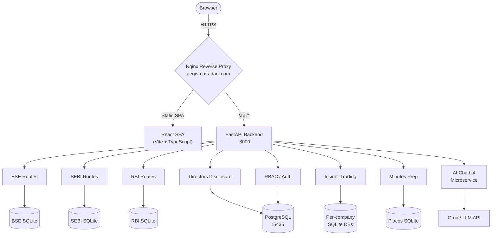

# 🛡️ Aegis: Codebase Walkthrough

## Overview

**Aegis** is an enterprise-grade **Regulatory Intelligence Suite** built for the Adani Group's Secretarial & Legal departments. It automates the monitoring of financial notifications from **BSE**, **SEBI**, and **RBI**, manages **director disclosures**, tracks **insider trading**, and generates **meeting minutes** — all from a single platform.

---

## High-Level Architecture



---

## Tech Stack

| Layer | Technology | Notes |
|-------|-----------|-------|
| **Frontend** | React 18 + TypeScript + Vite | SPA with Tailwind CSS, shadcn/ui, Framer Motion |
| **Backend** | Python FastAPI | Async, modular router-based architecture |
| **Primary DB** | PostgreSQL 16 | Directors, RBAC, user management (via Docker) |
| **Module DBs** | SQLite (per-service) | BSE, SEBI, RBI, Insider Trading — "database-per-agent" pattern |
| **AI/LLM** | Groq API | Document summarization, RAG chatbot |
| **Auth** | Azure AD SSO | Enterprise OIDC with role-based access control |
| **Proxy** | Nginx | SSL termination, PNA headers, multi-app routing |
| **Charting** | Recharts, ApexCharts, Highcharts, D3 | Multiple visualization libraries for different chart types |

---

## Directory Structure

```
aegis-prod-final/
├── Frontend/                     # React SPA
│   ├── src/
│   │   ├── App.tsx               # Router with ~40 routes
│   │   ├── pages/                # 31 page components + 3 sub-page dirs
│   │   ├── components/           # Shared UI: charts/, layout/, ui/, admin/
│   │   ├── contexts/             # AuthContext, InsiderTradingFilterContext
│   │   ├── services/             # API client functions
│   │   ├── hooks/                # Custom React hooks
│   │   ├── lib/                  # Utility functions
│   │   └── types/                # TypeScript type definitions
│   ├── package.json              # 50+ deps (React, Radix, Recharts, etc.)
│   ├── tailwind.config.ts        # Design system tokens
│   └── vite.config.ts            # Build config
│
├── Backend/
│   ├── aegis_backend/            # Primary API service
│   │   ├── fastapi_server.py     # App entrypoint — mounts all routers
│   │   ├── routes/               # 29 route modules (see below)
│   │   ├── utils/                # Shared backend utilities
│   │   ├── chatbot_minutes/      # Minutes chatbot sub-module
│   │   ├── public/               # SQLite databases
│   │   ├── director_images/      # Uploaded PAN documents
│   │   └── .env                  # Environment config
│   │
│   ├── chatbot_backend/          # AI Chatbot microservice
│   │   ├── llm_layer/            # LLM integration (Groq)
│   │   ├── indexing_layer/       # Document vectorization
│   │   ├── nlu_engine/           # Natural language understanding
│   │   ├── chat_orchestrator/    # Conversation flow management
│   │   └── routers/              # Chat API endpoints
│   │
│   └── scripts/                  # Data migration tools
│
├── docker-compose.yml            # PostgreSQL 16 container (:5435)
├── nginx.conf                    # Multi-app reverse proxy config
└── *.md                          # Project docs, interview prep
```

---

## Core Modules

### 1. BSE Intelligence (`/bse-alerts`)

| | |
|-|-|
| **Backend** | [routes/bse.py](file:///home/cognitbotz/Downloads/aegis-prod-final/Backend/aegis_backend/routes/bse.py) |
| **Frontend** | [pages/Dashboard.tsx](file:///home/cognitbotz/Downloads/aegis-prod-final/Frontend/src/pages/Dashboard.tsx), [TotalNotifications.tsx](file:///home/cognitbotz/Downloads/aegis-prod-final/Frontend/src/pages/TotalNotifications.tsx), [WeeklyAnalysis.tsx](file:///home/cognitbotz/Downloads/aegis-prod-final/Frontend/src/pages/WeeklyAnalysis.tsx) |
| **Database** | SQLite — BSE notifications |
| **Endpoints** | `/api/bse-alerts`, `/api/bse-monthly-count` |
| **Purpose** | Auto-scrapes BSE notifications, provides trend analytics dashboards |

### 2. SEBI Regulation Hub (`/sebi-dashboard`)

| | |
|-|-|
| **Backend** | [routes/sebi.py](file:///home/cognitbotz/Downloads/aegis-prod-final/Backend/aegis_backend/routes/sebi.py) |
| **Frontend** | [SEBIDashboard.tsx](file:///home/cognitbotz/Downloads/aegis-prod-final/Frontend/src/pages/SEBIDashboard.tsx), [SEBITotalNotifications.tsx](file:///home/cognitbotz/Downloads/aegis-prod-final/Frontend/src/pages/SEBITotalNotifications.tsx), [SEBIAnalysis.tsx](file:///home/cognitbotz/Downloads/aegis-prod-final/Frontend/src/pages/SEBIAnalysis.tsx) |
| **Database** | SQLite — `excel_summaries` table |
| **Endpoints** | `/api/sebi-analysis-data`, `/api/sebi-total-count` |
| **Purpose** | Tracks SEBI circulars with PDF links and AI summaries |

### 3. RBI Compliance Engine (`/rbi-dashboard`)

| | |
|-|-|
| **Backend** | [routes/rbi.py](file:///home/cognitbotz/Downloads/aegis-prod-final/Backend/aegis_backend/routes/rbi.py) |
| **Frontend** | [RBIDashboard.tsx](file:///home/cognitbotz/Downloads/aegis-prod-final/Frontend/src/pages/RBIDashboard.tsx), [RBITotalNotifications.tsx](file:///home/cognitbotz/Downloads/aegis-prod-final/Frontend/src/pages/RBITotalNotifications.tsx) |
| **Database** | SQLite — `rbi.db` / `master_summaries` |
| **Endpoints** | `/api/rbi-analysis-data`, `/api/rbi-total-count` |
| **Purpose** | Monitors RBI circulars, press releases, and policy updates |

### 4. Directors Disclosure (`/directors-disclosure`)

| | |
|-|-|
| **Backend** | [routes/directors_disclosure.py](file:///home/cognitbotz/Downloads/aegis-prod-final/Backend/aegis_backend/routes/directors_disclosure.py) (31KB — the largest route), [director_family_info.py](file:///home/cognitbotz/Downloads/aegis-prod-final/Backend/aegis_backend/routes/director_family_info.py), [director_data_analysis.py](file:///home/cognitbotz/Downloads/aegis-prod-final/Backend/aegis_backend/routes/director_data_analysis.py) |
| **Frontend** | [DirectorsDisclosure.tsx](file:///home/cognitbotz/Downloads/aegis-prod-final/Frontend/src/pages/DirectorsDisclosure.tsx) + sub-pages in `DirectorsDisclosure/` |
| **Database** | **PostgreSQL** — `directors_master`, `family_info`, `document_summaries` |
| **Key Features** | DIN/PAN management, family info tracking, PAN upload/download, `EnhancedIndianNameMatcher` for fuzzy matching |
| **Purpose** | Centralized director data with regulatory disclosure automation |

### 5. Insider Trading Monitor (`/insider-trading`)

| | |
|-|-|
| **Backend** | [routes/insider_trading.py](file:///home/cognitbotz/Downloads/aegis-prod-final/Backend/aegis_backend/routes/insider_trading.py), [insider_trading_db.py](file:///home/cognitbotz/Downloads/aegis-prod-final/Backend/aegis_backend/routes/insider_trading_db.py) |
| **Frontend** | [InsiderTrading.tsx](file:///home/cognitbotz/Downloads/aegis-prod-final/Frontend/src/pages/InsiderTrading.tsx) + sub-pages, filter context |
| **Database** | Multiple SQLite files — one per company (e.g., `adani_green_energy.db`) |
| **Endpoints** | `/api/insider-trading/summary`, `/api/insider-trading/company-data`, `/api/insider-trading/records/{company}` |
| **Purpose** | Tracks 3.9M+ investor positions across 6 Adani companies, detects changes |

### 6. Minutes Preparation (`/minutes-preparation`)

| | |
|-|-|
| **Backend** | [routes/minutes.py](file:///home/cognitbotz/Downloads/aegis-prod-final/Backend/aegis_backend/routes/minutes.py) |
| **Frontend** | 10+ pages under `minutes-preparation/`: Generator, Templates, AI Assistant, Chatbot, Agenda Creator, Secretarial Compliances |
| **Database** | SQLite — `places.db` for meeting locations |
| **Key Features** | DOCX template processing via `python-docx`, placeholder replacement, multi-director signature tables |
| **Purpose** | Automates board meeting minutes generation (4 hours → 15 minutes) |

---

## Cross-Cutting Concerns

### Authentication & RBAC

| | |
|-|-|
| **SSO** | Azure AD OIDC integration — [routes/auth.py](file:///home/cognitbotz/Downloads/aegis-prod-final/Backend/aegis_backend/routes/auth.py) |
| **RBAC** | Route-level permissions — [routes/rbac.py](file:///home/cognitbotz/Downloads/aegis-prod-final/Backend/aegis_backend/routes/rbac.py) (35KB), [user_management.py](file:///home/cognitbotz/Downloads/aegis-prod-final/Backend/aegis_backend/routes/user_management.py) |
| **Frontend Guard** | [ProtectedRoute.tsx](file:///home/cognitbotz/Downloads/aegis-prod-final/Frontend/src/components/ProtectedRoute.tsx), [RouteGuard.tsx](file:///home/cognitbotz/Downloads/aegis-prod-final/Frontend/src/components/RouteGuard.tsx) |
| **Context** | [AuthContext.tsx](file:///home/cognitbotz/Downloads/aegis-prod-final/Frontend/src/contexts/AuthContext.tsx) — wraps the entire app |
| **Admin** | `/access-request` for requesting access, `/admin-panel` for approval |

### AI / Chatbot Layer

| | |
|-|-|
| **Chatbot Backend** | Full microservice in `chatbot_backend/` with NLU engine, LLM layer (Groq), indexing, response generation |
| **Minutes Chatbot** | Separate sub-module in `aegis_backend/chatbot_minutes/` |
| **AI Assistant** | [routes/ai_assistant.py](file:///home/cognitbotz/Downloads/aegis-prod-final/Backend/aegis_backend/routes/ai_assistant.py) (43KB — the largest file) for document summarization |
| **Frontend** | [ChatbotFab.tsx](file:///home/cognitbotz/Downloads/aegis-prod-final/Frontend/src/components/ChatbotFab.tsx) — floating action button for AI chat |

### Deployment / Infrastructure

- **PostgreSQL**: Runs in Docker via `docker-compose.yml` on port **5435** (mapped to container 5432)
- **Nginx**: Production reverse proxy at `aegis-uat.adani.com` with SSL, HSTS, PNA headers, and routing for 6 different apps
- **FastAPI**: Serves both API endpoints and the built React SPA via `SPAStaticFiles` class
- **Port**: Backend runs on **:8000**

---

## Backend Route Modules (29 total)

| Route Module | File Size | Purpose |
|-------------|-----------|---------|
| `ai_assistant.py` | 43KB | AI-powered document analysis & summarization |
| `rbac.py` | 35KB | Role-based access control engine |
| `directors_disclosure.py` | 32KB | Director master data & disclosure management |
| `director_data_analysis.py` | 24KB | Director analytics & PostgreSQL queries |
| `chat.py` | 18KB | Chat API integration |
| `institutional_risk.py` | 18KB | Institutional risk monitoring |
| `EnhancedIndianNameMatcher.py` | 16KB | Fuzzy name matching for Indian names |
| `director_family_info.py` | 13KB | Family relationship & PAN management |
| `minutes.py` | 13KB | Meeting minutes DOCX generation |
| `registry_management.py` | 10KB | Director registry operations |
| `insider_trading.py` | 10KB | Insider trading summary & company data |
| `auth.py` | 9KB | Azure AD SSO authentication |
| `disclosure_downloader.py` | 8KB | Disclosure document downloads |
| `analytics.py` | 7KB | General analytics endpoints |
| `insider_trading_db.py` | 7KB | Per-company database access layer |
| `director_analysis.py` | 7KB | Director analysis queries |
| `user_management.py` | 6KB | User CRUD operations |
| `director_intelligence.py` | 6KB | Registry enrichment intelligence |
| `admin.py` | 5KB | Admin panel endpoints |
| `bse.py` | 5KB | BSE notification endpoints |
| `director_changes.py` | 4KB | Director change tracking |
| `visit_tracking.py` | 4KB | Visit/location tracking |
| `rbi.py` | 4KB | RBI notification endpoints |
| `sebi.py` | 4KB | SEBI notification endpoints |
| `excel.py` | 4KB | Excel file processing |
| `interactive.py` | 2KB | Interactive chart endpoints |
| `directors.py` | 2KB | Legacy directors endpoint |
| `health.py` | 1KB | Health check endpoint |
| `__init__.py` | 1KB | Module exports |

---

## Frontend Route Map (~40 routes)

| Route Pattern | Page Component | Module |
|--------------|----------------|--------|
| `/` | `LandingPage` | Landing |
| `/bse-alerts` | `Dashboard` | BSE |
| `/notifications` | `TotalNotifications` | BSE |
| `/emaildata` | `EmailData` | BSE |
| `/weekly-analysis` | `WeeklyAnalysis` | BSE |
| `/sebi-dashboard` | `SEBIDashboard` | SEBI |
| `/sebi-notifications` | `SEBITotalNotifications` | SEBI |
| `/rbi-dashboard` | `RBIDashboard` | RBI |
| `/rbi-notifications` | `RBITotalNotifications` | RBI |
| `/insider-trading/*` | `InsiderTrading` | Insider Trading |
| `/directors-disclosure/*` | `DirectorsDisclosure` | Directors |
| `/minutes-preparation` | `MinutesGenerator` | Minutes |
| `/minutes-preparation/form-generator` | `FormBasedGenerator` | Minutes |
| `/minutes-preparation/ai-assistant` | `AIAssistant` | Minutes |
| `/minutes-preparation/chatbot` | `MinutesChatbot` | Minutes |
| `/minutes-preparation/templates` | `Templates` | Minutes |
| `/access-request` | `AccessRequest` | RBAC |
| `/admin-panel` | `AdminPanel` | RBAC |
| `/hierarchy-structure` | `HierarchyStructure` | Org |

---

## Key Design Patterns

1. **Database-per-Agent**: Each regulatory source (BSE, SEBI, RBI, Insider Trading) has its own SQLite database, enabling independent data sovereignty
2. **ThreadPoolExecutor**: Blocking SQLite I/O is offloaded from the async FastAPI event loop via `concurrent.futures.ThreadPoolExecutor(max_workers=4)`
3. **SPA Static Serving**: The `SPAStaticFiles` class in `fastapi_server.py` serves the React build and handles client-side routing by falling back to `index.html`
4. **Route-Level RBAC**: Every protected frontend route is wrapped with `<ProtectedRoute requiredRoute="...">`, checked against the user's permissions from AuthContext
5. **Modular Routers**: All 29 backend routes are independent `APIRouter` instances, included with `/api` prefix in the main app
