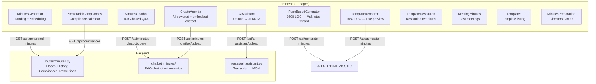

# 📋 Minutes Preparation Module — Code Review

## Module Scope
The Minutes Preparation module is the **largest feature** in Aegis — spanning **11 frontend pages**, **1 backend route module**, a **standalone chatbot microservice**, and several shared components. It automates board meeting minutes generation using DOCX templates, manages compliance calendars, and includes an AI-powered meeting assistant.

---

## Architecture Overview



---

## 🔴 Critical Issues

### 1. Missing `POST /api/generate-minutes` endpoint

> [!CAUTION]
> **The core document generation endpoint does not exist in the active backend codebase.** Both `FormBasedGenerator.tsx` (L480) and `TemplateRenderer.tsx` (L241) call `POST /api/generate-minutes`, but this endpoint only exists in `Backend/backup/fastapi_server.py` — the **legacy monolith backup**, not in the current modular `routes/minutes.py`.

**Impact**: The primary user flow — filling the multi-step form and generating a DOCX — returns a 404/405 error in production.

**Fix**: Port the `generate-minutes` handler from the backup file into `routes/minutes.py` and register it properly.

---

### 2. Missing `POST /api/places` endpoint

> [!WARNING]
> `routes/minutes.py` has a `GET /places` endpoint (L236) but **no `POST /places` endpoint**. However, `PlaceSelector.tsx` (L65) issues `POST /api/places` to create new meeting places. This would fail with 405 Method Not Allowed.

---

### 3. Missing `POST /api/upload-template` endpoint

> [!WARNING]
> `FormBasedGenerator.tsx` (L237) calls `POST /api/upload-template` for custom DOCX template uploads. This endpoint is not defined in `routes/minutes.py` or any other active route module.

---

### 4. Missing `POST /api/directors-master` CRUD endpoints

> [!WARNING]
> `MinutesPreparation.tsx` calls `GET/POST/PUT/DELETE /api/directors-master` for director management (L107, L150, L177, L201). These endpoints need to be verified in `routes/director_data_analysis.py` — the route module isn't visible in `minutes.py`.

---

## 🟠 Significant Issues

### 5. Navigation items duplicated across 10+ files

Every page in the minutes module **hardcodes the same ~10-item navigation array**. There are subtle inconsistencies:

| File | Missing "Meeting Assistant" link | Has "User Manual" | Has "Renderer" |
|------|-----|-----|-----|
| `MinutesPreparation.tsx` | ✅ Has it | ✗ | ✗ |
| `MinutesGenerator.tsx` | ✗ Missing | ✅ | ✗ |
| `FormBasedGenerator.tsx` | ✅ Has it | ✅ | ✗ |
| `TemplateRenderer.tsx` | ✗ Missing | ✅ | ✅ |
| `MinutesChatbot.tsx` | ✅ Has it | ✅ | ✗ |

**Fix**: Extract `navigationItems` into a shared constant (e.g., `src/constants/minutesNavigation.ts`).

---

### 6. Company presets hardcoded in 3 separate files

Adani company data (names, addresses, directors) is duplicated in:
- [FormBasedGenerator.tsx:312-339](file:///home/cognitbotz/Downloads/aegis-prod-final/Frontend/src/pages/minutes-preparation/FormBasedGenerator.tsx#L312-L339)
- [MinutesGenerator.tsx:45-64](file:///home/cognitbotz/Downloads/aegis-prod-final/Frontend/src/pages/minutes-preparation/MinutesGenerator.tsx#L45-L64)
- Each has **different data**: MinutesGenerator has 2 companies while FormBasedGenerator has 3

**Fix**: Fetch from the API or centralize in a shared constants file.

---

### 7. `CreateAgenda.tsx` — Fake AI generation (hardcoded output)

[CreateAgenda.tsx:107-151](file:///home/cognitbotz/Downloads/aegis-prod-final/Frontend/src/pages/minutes-preparation/CreateAgenda.tsx#L107-L151) uses:
```js
await new Promise(resolve => setTimeout(resolve, 3000)); // fake delay
setGeneratedAgenda(`AGENDA FOR THE ${meetingType}...`); // hardcoded template string
```

The "AI-powered agenda generation" feature is **simulated**. It uploads files to the chatbot for indexing but never actually queries for AI-generated content.

---

### 8. Hardcoded user email in chatbot

[MinutesChatbot.tsx:59](file:///home/cognitbotz/Downloads/aegis-prod-final/Frontend/src/pages/minutes-preparation/MinutesChatbot.tsx#L59):
```ts
const userEmail = "admin@adani.com"; // hardcoded
```
[CreateAgenda.tsx:124](file:///home/cognitbotz/Downloads/aegis-prod-final/Frontend/src/pages/minutes-preparation/CreateAgenda.tsx#L124):
```ts
headers: { 'X-User-Email': 'admin@adani.com' }
```
The AuthContext exists but isn't being used. All chatbot interactions are attributed to a single user.

---

### 9. DB connection leak pattern in `routes/minutes.py`

Every endpoint in [minutes.py](file:///home/cognitbotz/Downloads/aegis-prod-final/Backend/aegis_backend/routes/minutes.py) creates a new connection per request but doesn't use connection pooling. While `try/finally` blocks close connections, the pattern of `conn = get_pg_connection()` inside every closure is fragile and creates connection churn:

```python
def fetch():
    conn = get_pg_connection(os.getenv('POSTGRES_DATABASE_MINUTES'))  # new conn each call
    if not conn: return []
    cursor = get_pg_cursor(conn)
    try:
        ...
    finally:
        conn.close()
```

The `if not conn: return []` silently swallows database failures — the user gets empty data with no error.

---

### 10. `FormBasedGenerator.tsx` is 1608 lines — needs decomposition

This single component handles:
- Template & company selection (step 0)
- Meeting details (step 1)
- Attendance with multi-director selector (step 2)
- Legal disclosures (step 3, Q1 only)
- Auditor payment with auto-word conversion (step 4, Q1 only)
- Financial statements (step 5, Q1 only)
- AGM details (step 6, Q1 only)
- Sign-off details (step 7)
- Resolutions (step 8)
- Review & generate (step 9)

Each step should be its own component file. The conditional step logic (Q1 has 10 steps, Q2-Q4 has 6) is manageable but the **76KB single file** is not.

---

## 🟡 Minor Issues

### 11. `useEffect` missing dependency in `TemplateRenderer.tsx`

```tsx
useEffect(() => {
    loadTemplateContent();
}, [formData.template, formData]); // formData includes formData.template — redundant
```
`formData` changes on every keystroke, causing `loadTemplateContent()` to fire on every character typed. This is a **performance issue**.

---

### 12. `alert()` used instead of toast notifications

[FormBasedGenerator.tsx](file:///home/cognitbotz/Downloads/aegis-prod-final/Frontend/src/pages/minutes-preparation/FormBasedGenerator.tsx) and [MinutesPreparation.tsx](file:///home/cognitbotz/Downloads/aegis-prod-final/Frontend/src/pages/MinutesPreparation.tsx) use native `alert()` and `confirm()` dialogs instead of the project's shadcn/sonner toast system that exists elsewhere.

---

### 13. `asyncio.get_event_loop()` deprecation

[minutes.py](file:///home/cognitbotz/Downloads/aegis-prod-final/Backend/aegis_backend/routes/minutes.py) uses `asyncio.get_event_loop()` (L178, L209, L248, etc.) which is deprecated in Python 3.10+. Should use `asyncio.get_running_loop()`.

---

### 14. `error.message` accessed without type guard

[FormBasedGenerator.tsx:509](file:///home/cognitbotz/Downloads/aegis-prod-final/Frontend/src/pages/minutes-preparation/FormBasedGenerator.tsx#L509):
```tsx
alert(`Error generating document: ${error.message || 'Please try again.'}`);
```
TypeScript strict mode would flag `error` as `unknown` in a catch block.

---

### 15. Duplicate route definitions in `App.tsx`

```tsx
<Route path="/minutes-preparation/directors" ... />  // L194-198
<Route path="/minutes-preparation/directors" ... />  // L209-213 (duplicate!)
```
The `/minutes-preparation/directors` route is defined **twice** in [App.tsx](file:///home/cognitbotz/Downloads/aegis-prod-final/Frontend/src/App.tsx#L194-L213).

---

## ✅ What's Done Well

| Aspect | Assessment |
|--------|-----------|
| **Multi-step wizard UX** | The `Stepper` + conditional Q1/Q2-Q4 flow is well-designed and user-friendly |
| **Auto-calculations** | Day-of-week from date, ordinal numbers, amount-in-words conversion — thoughtful automation |
| **PlaceSelector component** | Clean reusable component with DB-backed dropdown + custom input + add-new dialog |
| **Chatbot UI** | `MinutesChatbot.tsx` has a polished ChatGPT-style interface with session management and source attribution |
| **Template renderer** | Live preview of DOCX template with inline placeholder editing is innovative |
| **Backend modularity** | Separation of `minutes.py`, `chatbot_minutes/`, and `ai_assistant.py` is architecturally sound |
| **Chatbot RAG pipeline** | Proper document upload → text extraction → embedding → query pipeline with session history |

---

## Summary & Priority Matrix

| Priority | Issue | Effort |
|----------|-------|--------|
| 🔴 P0 | Port `generate-minutes` endpoint from backup | Medium |
| 🔴 P0 | Add `POST /api/places` endpoint | Low |
| 🔴 P0 | Add `POST /api/upload-template` endpoint | Low |
| 🟠 P1 | Extract shared navigation config | Low |
| 🟠 P1 | Replace hardcoded user email with AuthContext | Low |
| 🟠 P1 | Implement real AI agenda generation | High |
| 🟠 P1 | Decompose FormBasedGenerator.tsx | Medium |
| 🟡 P2 | Fix useEffect dependencies | Low |
| 🟡 P2 | Replace alert() with toast | Low |
| 🟡 P2 | Fix duplicate route in App.tsx | Low |
| 🟡 P2 | Fix asyncio deprecation | Low |
